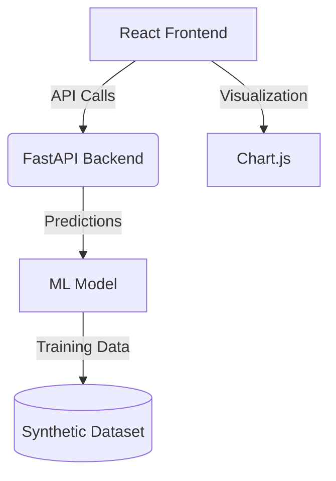

# 🚦 Traffic Flow Prediction System

A machine learning-powered system that predicts traffic congestion based on weather conditions, time of day, and historical patterns. Features a FastAPI backend with a trained RandomForest model and an interactive React dashboard.

## 🌟 Key Features

- **Real-time Traffic Predictions** - Get congestion estimates based on current conditions
- **Interactive Dashboard** - Visualize traffic patterns with dynamic charts
- **Machine Learning Model** - RandomForest algorithm trained on synthetic traffic data
- **REST API** - FastAPI backend with Swagger documentation
- **Modern Frontend** - React + TypeScript with Vite build system

## 🛠️ Tech Stack

| Component | Technology |
|-----------|------------|
| Backend | Python 3.9+, FastAPI, Scikit-learn |
| Frontend | React 18, TypeScript, Vite, Chart.js |
| Package Mgmt | Pipenv (Python), npm (Node.js) |
| API Docs | Swagger UI, OpenAPI 3.0 |

## 🚀 Getting Started

### Prerequisites

- Python 3.9+
- Node.js 16+
- Pipenv (`pip install pipenv`)
- npm (comes with Node.js)

### Installation

1. Clone the repository
```bash
git clone https://github.com/yourusername/traffic-prediction-system.git
cd traffic-prediction-system
```

2. Set up backend
```bash
cd backend
pipenv install
pipenv run uvicorn app.main:app --reload
```

3. Set up frontend
```bash
cd ../frontend
npm install
npm run dev
```

4. Access the applications
   - Backend API: http://localhost:8000
   - API Docs: http://localhost:8000/docs
   - Frontend: http://localhost:5173

## 📊 System Architecture



## 📂 Project Structure

```
traffic-prediction-system/
├── backend/               # FastAPI application
│   ├── app/               # Main application code
│   │   ├── __init__.py
│   │   ├── main.py        # FastAPI routes
│   │   ├── models.py      # ML model and schemas
│   │   └── utils.py       # Helper functions
│   ├── Pipfile            # Python dependencies
│   └── Pipfile.lock
└── frontend/              # React application
    ├── public/
    ├── src/
    │   ├── components/    # React components
    │   ├── hooks/         # Custom hooks
    │   ├── types/         # TypeScript interfaces
    │   ├── App.tsx        # Main app component
    │   └── main.tsx       # Entry point
    ├── package.json
    └── vite.config.ts
```

## 🧪 Testing the System

Test the API directly:

```bash
curl -X POST "http://localhost:8000/predict" \
-H "Content-Type: application/json" \
-d '{"temperature": 22, "rainfall": 5, "hour": 17, "is_weekend": false}'
```

Example Response:
```json
{
  "predicted_traffic": 6.34
}
```

## 🤝 Contributing

1. Fork the project
2. Create your feature branch (`git checkout -b feature/theFeature`)
3. Commit your changes (`git commit -m 'Add some feature/theFeature'`)
4. Push to the branch (`git push origin feature/theFeature`)
5. Open a Pull Request